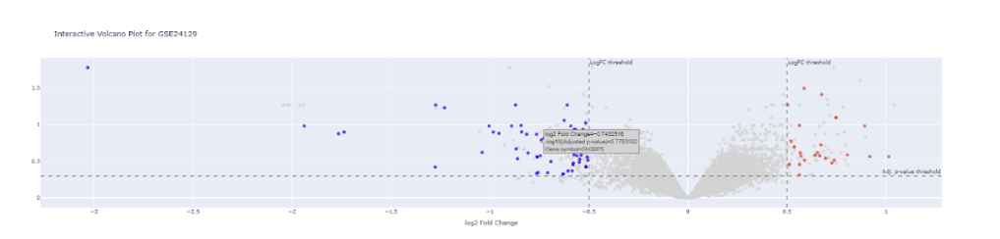
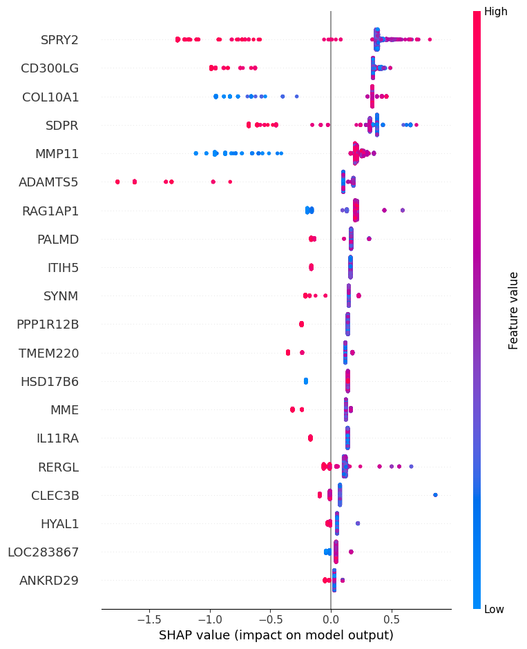
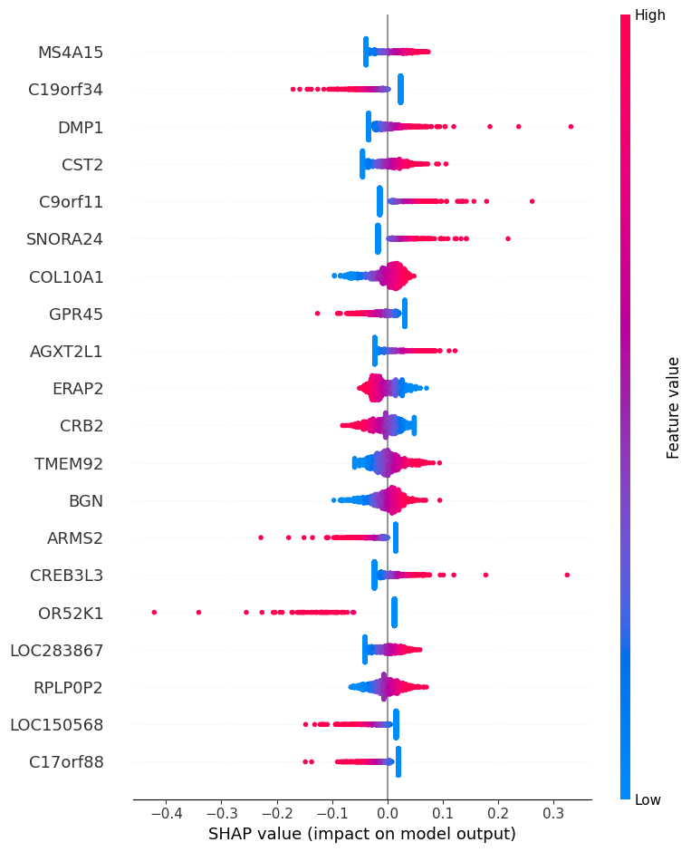
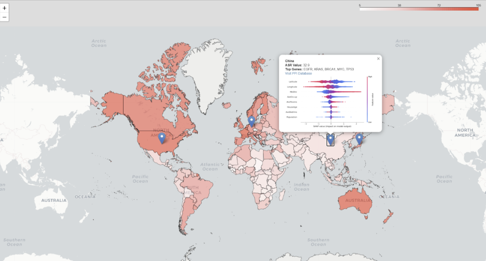

# Biomarker Analysis and Visualization Repository

Welcome to the Biomarker Analysis and Visualization Repository. This repository provides the code, data, and visualizations used in the project, which focuses on identifying regional biomarker differences using advanced visualization techniques and machine learning tools.

## Table of Contents
- [Overview](#overview)
- [Repository Structure](#repository-structure)
- [Setup Instructions](#setup-instructions)
- [Example Usage](#example-usage)
- [Visualizations](#visualizations)
- [Acknowledgments](#acknowledgments)

## Overview
This project combines gene expression data, spatial data, and machine learning outputs to identify and visualize significant biomarkers across regions. Key visualizations include enhanced volcano plots, SHAP beeswarm plots for feature importance, and GeoJSON-based maps for spatial biomarker analysis.

## Repository Structure

{
  RepositoryStructure {
    Code {
      File: "TCGA_preprocessing_SHAP.ipynb"  # Preprocessing and SHAP Analysis Code
      File: "Volcano_Plot.ipynb"             # Notebook for Volcano Plot Generation
      File: "Map.ipynb"                      # Notebook for GeoJSON Map Creation
    }
    Data {
    }
    Visualization {
      File: "Volcano_Plot.png"               # Static Volcano Plot
      File: "Map.png"                        # Biomarker GeoJSON Map
      File: "SHAP_XGBoost.png"               # SHAP Beeswarm Plot (XGBoost)
      File: "SHAP_log.png"                   # SHAP Beeswarm Plot (Logistic Regression)
    }
    RootFiles {
      File: "README.md"                      # Root README file (this document)
    }
  }
}


## Setup Instructions

To run the code and generate the visualizations, please follow these steps:

1. **Clone the repository**:
   ```bash
   gh repo clone YP-118/Info_Interim
    ```
   
2. **Set up the Python environment**: Ensure you have Python 3.8 or above installed.
   
3. **Install additional libraries used in the visualizations**: This project requires the following Python libraries:

   - **Folium** (for interactive maps):
     ```bash
     pip install folium
     ```

   - **Matplotlib** (for static plots):
     ```bash
     pip install matplotlib
     ```

   - **Plotly** (for interactive plots):
     ```bash
     pip install plotly
     ```

4. **Run the notebooks**: Navigate to the `Code/` folder and open the notebooks in Jupyter Notebook, JupyterLab, or any compatible IDE (e.g., VSCode).

## Example Usage

Here’s an example of how to run the notebooks:

1. **Volcano Plot**:
   - Open the `Volcano_Plot.ipynb` notebook in the `Code/` directory.
   - Follow the instructions to load the data and generate the volcano plot.
   - The output will be saved to `Visualization/Volcano_Plot.png`.

2. **SHAP Analysis**:
   - Open the `TCGA_preprocessing_SHAP.ipynb` notebook in the `Code/` directory.
   - This notebook processes TCGA data and generates SHAP beeswarm plots for feature importance.
   - The visualizations will be saved as `Visualization/SHAP_XGBoost.png` and `Visualization/SHAP_log.png`.

3. **GeoJSON Map**:
   - Open the `Map.ipynb` notebook in the `Code/` directory.
   - Follow the steps to generate an interactive GeoJSON-based map visualizing biomarkers by region.
   - The output will be saved to `Visualization/Map.png`.
## Visualizations

Below are links to key visualizations generated in the project:

- [Volcano Plot](Visualization/Volcano_Plot.png): Highlights statistically significant biomarkers across datasets.
  

- [SHAP Beeswarm Plot (XGBoost)](Visualization/SHAP_XGBoost.png): Displays feature importance from XGBoost models.
  

- [SHAP Beeswarm Plot (Logistic Regression)](Visualization/SHAP_log.png): Displays feature importance from Logistic Regression models.
  

- [GeoJSON Map](Visualization/Map.png): Visualizes regional biomarker variations with ASR overlay.
  

## Acknowledgments

This project uses data from:

- **TCGA** (via UCSC Xena Browser)
- **NCBI GEO**
- **Global Cancer Observatory (IARC)**

We also utilized Python libraries such as **Folium**, **Matplotlib**, and **Plotly** for visualization, and integrated concepts from the *Visualization Basics* repository for structuring and presenting data effectively.


